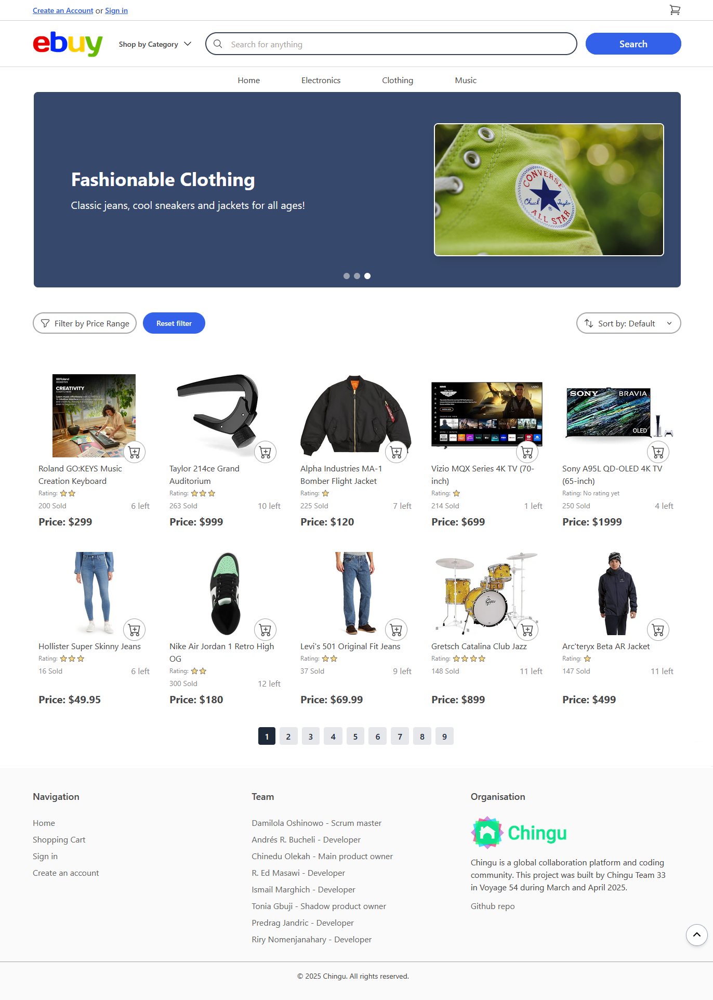

# Ebuy

# 🔗 [Live preview](https://ebuy.fly.dev/)

# ▶️ [Video walkthrough by dev]()

<!--  -->

---

## Table of Contents

- [About Project](#about-project)
- [Features](#features)
- [How it works](#how-it-works)
- [Technologies & Dependencies used](#technologies--dependencies-used)
- [Prerequisites](#prerequisites)
- [Clone & Run locally](#clone--run-locally)
- [Team](#team)
- [Special Thanks](#special-thanks)
- [Contributing](#contributing)

## About Project

Ebuy is a full-stack, scaled down clone of Ebay. We successfully completed this project by following the Agile framework, focusing on team communication, task management, and planning ahead. Frontend and Backend teams worked closely together, collaborating throughout the project to bring the idea to life.

---

## Features

- **Product Browsing:** Users can browse through a wide range of products displayed in a grid layout and apply different display criteria (filter, sort etc).
- **Category Filtering:** Products can be filtered by categories such as Electronics, Clothes, and Music.
- **Search Functionality:** Users can search for specific products using a search bar.
- **Pagination:** Products are displayed in paginated views, allowing users to navigate through multiple pages of items.
- **Shopping Cart:** Users can add products to their cart, adjust quantities, and remove items.
- **Order History:** Logged-in users can view their past orders on their profile page, with the latest order highlighted.
- **User Authentication:** Users can sign in, register, and log out securely.
- **Responsive Design:** The app is fully responsive and works seamlessly on desktops, tablets, and mobile devices.

---

## Team

Voyage 54 - Team 33. March 2025 - May 2025. 8 weeks

- Damilola Oshinowo: [GitHub](https://github.com/dami-boy) / [LinkedIn](https://linkedin.com/in/damilola-oshinowo)
- Chinedu Olekah: [GitHub](https://github.com/kenako0127) / [LinkedIn](www.linkedin.com/in/chinedu-olekah)
- Tonia Gbuji: [GitHub](https://github.com/Tgee78) / [LinkedIn](https://www.linkedin.com/in/toniagbuji/)
- Ismail Marghich: [GitHub](https://github.com/IsmailMarghich) / [LinkedIn](https://www.linkedin.com/in/ismail-marghich-9174111aa/)
- Riry Nomenjanahary: [GitHub](https://github.com/TiaDev7474) / [LinkedIn](https://www.linkedin.com/in/riry-nomenjanahary/)
- R. Ed Masawi as Backend dev [GitHub](https://github.com/Masawi68) / [LinkedIn](https://www.linkedin.com/in/ed-masawi-97345a29/)
- Predrag Jandric as Frontend dev [GitHub](https://github.com/Predrag-Jandric) / [LinkedIn](https://www.linkedin.com/in/predrag-jandric/)
- Andrés R. Bucheli as Frontend dev [GitHub](https://github.com/ARBUCHELI) / [LinkedIn](https://www.linkedin.com/in/andresregaladobucheli/)

### Roles and Responsibilities

- Damilola Oshinowo (Scrum Master) made sure all meetings were productive and scheduled at times that worked best for everyone. He kept the team communicating, made sure daily stand-ups were posted, and helped solve any issues that came up.

- Chinedu Olekah (Product Owner) was responsible for creating an extensive document that outlined all the features for each product iteration (MVP). He kept it updated by tracking which features were completed and which ones were still pending.

- Tonia Gbuji (Shadow Product Owner) played a supportive role to the main product owner. She used this voyage as a big learning experience, getting hands-on insight into how real development teams are managed.

- Ismail Marghich (Backend Developer) worked on key backend features, set up and managed the Mongo database, fixed bugs, and helped the team move forward by doing a lot of pair programming sessions with other developers. He was also responsible for deploying the app live.

- Riry Nomenjanahary (Backend Developer) built the authentication system, making it possible for users to create an account, sign in, and log out. He also fixed bugs, worked on other backend features, and did pair programming.

- Riry Nomenjanahary (Backend dev) contributed with a lot of backend logic, primarily everything related to authentication, making possible user creating and account, signing in and loggin out. He also fixed bugs, implemented some other minor backend features and did pair programming sessions with other developers.

- R. Ed Masawi (Backend Developer) contributed to a few backend features and joined pair programming sessions to help push the project forward.

- Predrag Jandric (Frontend Developer) worked mainly on the frontend logic and styling, and also did a lot of pair programming with other developers. His idea for the app was the one selected — which is why we ended up building this project!

- Andrés R. Bucheli (Frontend Developer) decided to leave the team early on, but he still helped out during the initial stages by contributing to the frontend setup.

---

### Special Thanks

We as a whole team would like to thank Chingu platform and community for this opportunity to learn, improve and collaborate. Thank you Chingu !

Chingu is a platform that helps developers and other people in tech related roles practice in-demand skills and accelerate their learning through collaboration and project-building.

Learn more about Chingu platform at https://www.chingu.io/

---

# How to start frontend

1. **Clone the Repository:**

   - On the GitHub repo page, click the green "Code" button.

   - Copy the HTTPS URL.

2. **Open the Terminal:**

   - Open the terminal by typing "cmd" in your desktop's start menu, **OR**

   - Right-click on the desktop and select "Git Bash Here" (if you have Git Bash installed), **OR**

   - Open Visual Studio Code's terminal by clicking "Terminal" -> "New Terminal" inside the editor.

3. **Navigate to Your Project Location:**

   - In the terminal, navigate to your desired location (e.g., desktop) using the command: `cd desktop`.

4. **Clone the Repository:**

   - Run the command: `git clone /link/`. Replace `/link/` with the HTTPS URL from step 1.

5. **Enter the Project Directory:**

   - Navigate into the cloned repository by using command `cd V54-tier3-team-33` Then command `cd frontend`. You are now inside frontend folder

6. **Install Dependencies:**

   - Run the command: `npm i` to install all the necessary dependencies.

7. **Start the Project:**

   - Run the command: `npm run dev` to start the project. You will need to manually open the browser address at [localhost:5173/](http://localhost:5173/)

---
